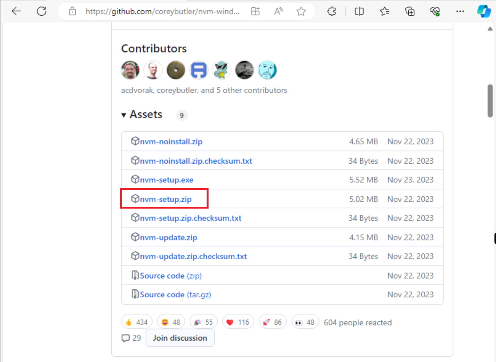
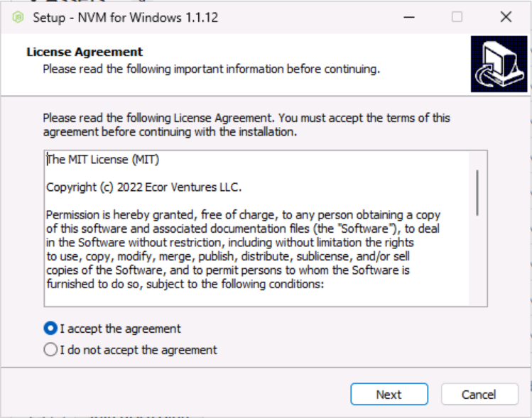
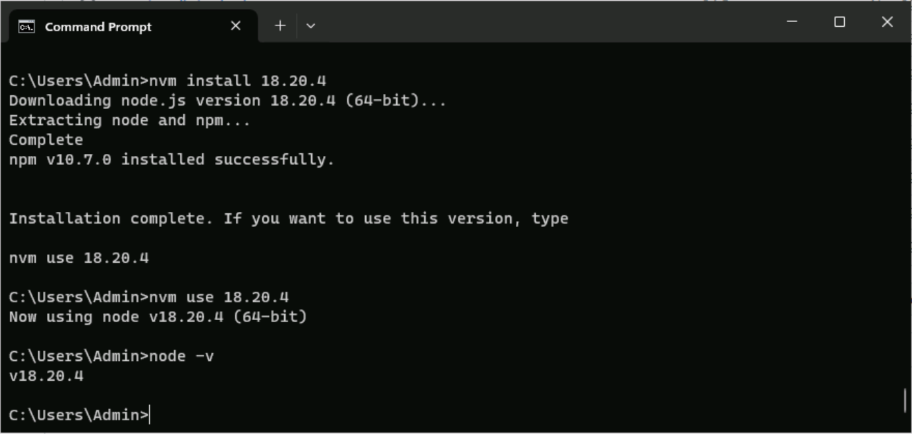

# 实验室教学设置

在完成实验室之前，请完成以下任务以准备你的开发环境。

## 实验先决条件

你需要具有以下工具才能完成本课程的实验室：

- 对 Microsoft 365 租户的管理员访问权限。
- Azure 订阅。
- Visual Studio Code。
- Teams Toolkit Visual Studio Code 扩展：版本 5.8.1 或更高版本。 （将在实验室期间安装）
- Microsoft Teams 客户端（适用于工作场所或学校），或通过 Web 浏览器访问 Microsoft Teams。
- Node.js 版本 18.20.4。

## 安装 nvm-windows

你将使用此工具安装Node.js，并根据需要为项目切换所需的 Node 版本。

1. 在网页浏览器中，导航到 [https://github.com/coreybutler/nvm-windows/releases](https://github.com/coreybutler/nvm-windows/releases)。
2. 找到最新发布的版本，然后选择要下载的 **nvm-setup.zip** 文件。  将该文件下载到计算机。 
3. 打开文件夹，并将 zip 文件夹的内容**提取**到计算机上的某个文件夹中。
4. 从新的文件夹中，选择 **nvm-setup.exe** 以打开安装文件。
5. 按照安装程序中的提示，使用默认选项安装该工具。 
6. 将在计算机上安装 Nvm for Windows。

## 安装 Node.js

安装 Node.js 18.20.4 版本，该版本与本课程中的所有解决方案兼容。

1. 打开**命令提示符**应用程序。
2. 输入命令 `nvm install 18.20.4` 以安装 Node.js。
3. nvm 输出应确认安装已完成。
4. 运行命令 `nvm use 18.20.4` 以使用此版本的 Node.js。
5. 运行 `node -v` 命令，确认已安装 18.20.4 版本。

现已安装和配置了 Node.js 18.20.4 版本 

## Azure 订阅

请注意，如果已提供了 Azure 登录信息，则已创建了一个资源组供你使用。  对于整个实验室中的预配任务，当系统提示“选择资源组或创建新资源组”时，**请选择已提供的资源组**。

## 调试 Teams 应用

当在本地调试 Teams 应用时，系统可能会提示你安装 localhost 的开发证书。  需要执行此操作才能在本地进行调试。

出现提示时，选择“安装”。

然后在“安全警告”对话框中选择“**是**”。

访问 Teams 文档了解详细信息：[在本地调试 Teams 应用](https://learn.microsoft.com/microsoftteams/platform/toolkit/debug-local?tabs=Windows&pivots=visual-studio-code-v5)
