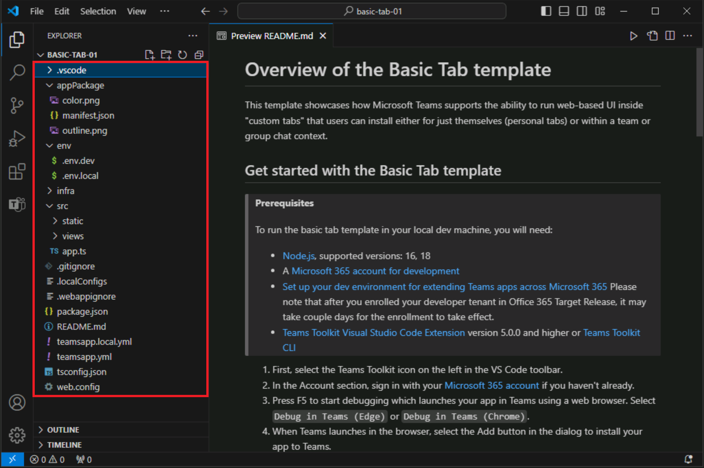

# 练习 2：使用 Teams Toolkit 创建 Teams 应用

适用于 Visual Studio Code 的 Teams Toolkit 提供了两种方法来创建新应用。 可以使用该工具包提供的内置模板创建新应用。 此外，适用于 Visual Studio Code 的 Teams Toolkit 还提供了一系列示例，可供你浏览和创建基础应用。 

在本练习中，你将使用内置模板创建你的第一个 Microsoft Teams 应用。

## 任务 1：创建新的 Teams 应用

1. 在 Visual Studio Code 边栏中，选择“Teams 工具包”按钮以打开 Teams 工具包。****
1. 在 Teams 工具包中，选择“创建新应用”。****

   

1. 在“新建项目”菜单上，选择**“选项卡”。****

   
   
1. 当系统提示选择功能时，请选择“基本选项卡”。****
1. 当系统提示选择编程语言时，请选择“TypeScript”。****
1. 当系统提示选择文件夹时，请选择“默认文件夹”或选择其他文件位置。****
1. 为基本选项卡应用输入你任选的应用程序名称，然后选择 Enter。********
1. Teams 工具包将为新应用搭建基架，并在 Visual Studio Code 中打开项目文件夹。
1. 你可能会从 Visual Studio Code 收到一条消息，询问你是否信任此文件夹中的文件创建者。 选择“**是，我信任作者**”按钮以继续。

   

1. 现在，可以查看项目代码，其中包括：

- Teams 应用代码。
- appPackage 文件夹中的部署和清单文件。
- env 文件夹中的环境变量。
- 自述文件，提供运行、调试和部署应用所需的步骤。

  
