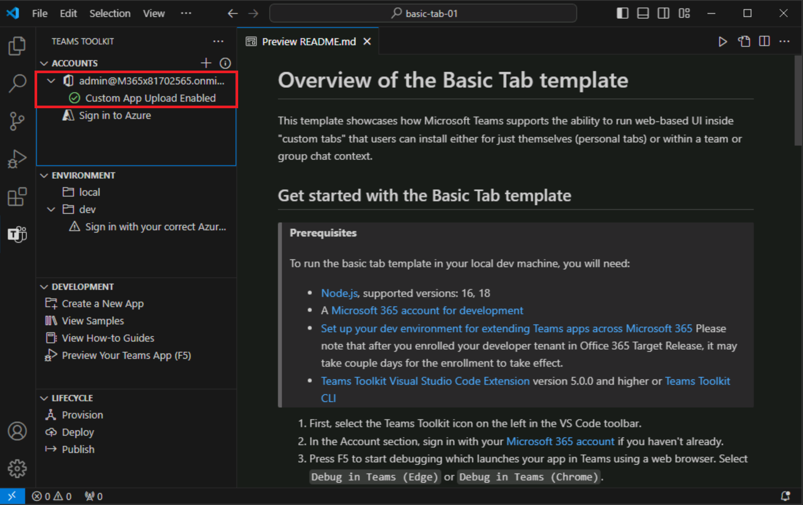

# 练习 3：运行 Teams 应用

在本练习中，你将在本地运行 Teams 应用。

## 任务 1：登录到 Microsoft 365

1. 在 Visual Studio Code 中，打开“Teams 工具包”，然后选择“登录到 Microsoft 365”********。

    

2. 在弹出对话框中，选择“登录”****。 你会转到一个浏览器，可在其中使用 Microsoft 365 帐户凭据登录。****  输入你的管理员凭据。

3. 成功登录后，关闭浏览器并返回到 Visual Studio Code。 在 Teams 工具包中，你的帐户下会显示“已启用自定义应用上传”消息，指示你的租户已正确配置****。

    

## 任务 2：在本地运行应用

让我们运行项目，看看它在 Microsoft Teams 中的外观。

1. 在边栏中，选择“调试”图标打开“运行并调试”面板********。
2. 在“运行并调试”面板上，在下拉列表框中选择“Chrome”或“Edge”作为要用于调试机器人的浏览器************。  然后选择“播放”按钮（或按“F5”键）启动调试会话********。
3. Teams 工具包将完成先决条件检查（可能需要一两分钟）。
4. 接下来，Teams 工具包会在选择的浏览器中打开 Microsoft Teams。
5. 使用用于登录到 Teams 工具包的同一 **Microsoft 365** 帐户登录。
6. 然后，Teams 会显示用于安装应用的选项。 选择“添加”以预览应用****。
7. 当你预览时，应用的名称带有 *local* 后缀。 该后缀表示该应用正在本地运行，且尚未部署。

    

8. 若要详细了解项目结构以及如何使用和自定义应用，请打开项目文件夹下的“README.md”文件****。

现在，你已根据示例创建了一个 Teams 应用并在本地运行它。
