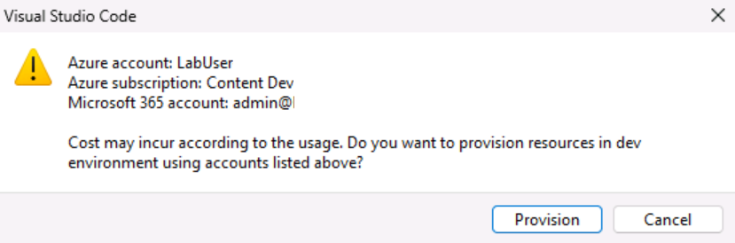

# 练习 1：创建 Azure 资源以托管 Teams 选项卡应用

在本练习中，你将首先使用 Teams Toolkit for Visual Studio Code 创建并预配 Teams 选项卡应用。 在后面的练习中，你会将该应用设置为托管在 Azure 中。

**注意**：本培训模块中的练习使用 Teams Toolkit v5.0.0。 以下步骤假定已安装 Teams Toolkit 扩展。

## 任务 1：创建一个新的选项卡应用

1. 在 Visual Studio Code 中的活动栏上，选择 Microsoft Teams 图标。****

1. 在 Teams Toolkit 面板中，选择“创建新应用”按钮。****

1. 从选项中选择“选项卡”。****

    

1. 接下来，选择“使用 Fluent UI 进行反应”。****

    

1. 从编程语言的选项中选择“JavaScript”。****

1. 为选项卡应用项目文件夹及其文件选择一个位置。****

1. 对于应用程序名称，输入“hello-tab”，然后选择 Enter。****

1. 项目基架将开始搭建。 当搭建项目基架时，将打开一个新的 Visual Studio Code 窗口，并在其中加载新项目。

    

1. 在 Visual Studio Code 中，选择“运行”>“开始调试”或选择 F5 键以启动调试会话。********

1. Visual Studio Code 将生成并启动应用程序。 在开始预配任何 Azure 资源之前，请运行调试会话。

1. 成功测试应用后，停止在本地运行应用。

1. 若要结束调试会话并停止运行应用，可以关闭浏览器并选择“运行”>“停止调试”，或者选择 Shift+F5。********

## 任务 2：在 Teams Toolkit 中登录到 Azure

使用你的 Azure 订阅帐户登录到 Azure。****

1. 在活动栏上，选择 Microsoft Teams 图标。****

1. 在 Teams Toolkit 面板中的“帐户”下，选择“登录到 Azure”。********

    

1. 在出现的对话框中，选择“确定”。****

    

## 任务 3：预配资源

现在，你可以预配 Teams 选项卡应用所需的资源。

1. 在 Teams Toolkit 面板中的“生命周期”下，选择“预配”。********

    

1. 接下来，你需要选择一个你可以在其中预配资源的资源组，或者通过在“选择资源组”菜单上选择“新建资源组”选项来创建一个新资源组。********

    

1. 该工具会自动推荐资源组名称，例如 rg-hello-tab0989fd-dev。 选择 **Enter**。

1. 接下来，为新资源组选择“美国东部”位置，然后选择 Enter。********

1. 在确认选择的对话框中，选择“预配”。****

    

1. 此时将开始为在 Azure 中托管 Teams 选项卡应用所需的所有资源进行预配。 预配可能需要花费一段时间。

你现在已成功预配了托管 Teams 选项卡应用程序所需的所有资源。

接下来，你需要将你的应用的源代码部署到这些资源。
