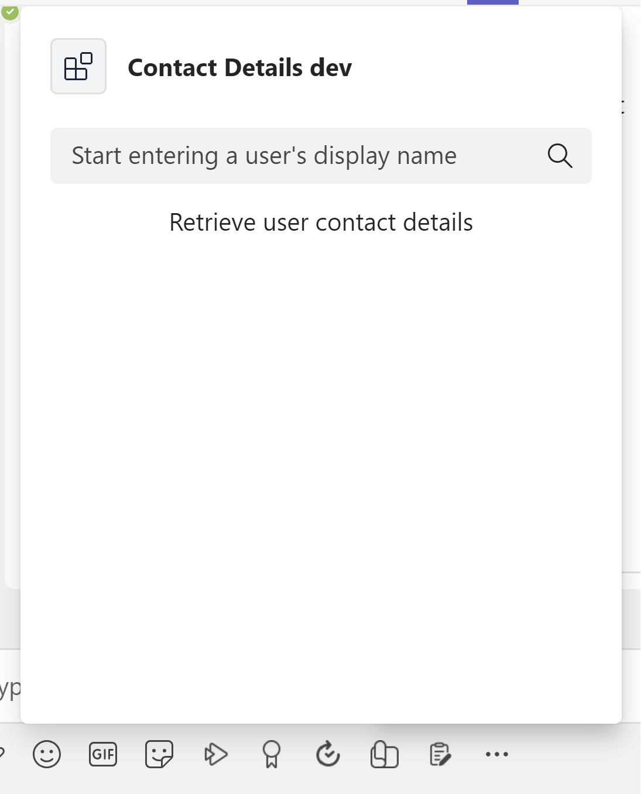
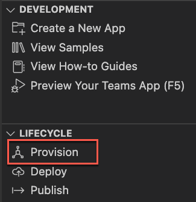

---
lab:
  title: 实现从 Microsoft Graph 检索数据的消息扩展
  module: Exercise 1
---

# 练习 1：实现从 Microsoft Graph 检索数据的消息扩展

## 场景

假设你被要求帮助 IT 支持团队构建一个消息扩展，该扩展要让团队成员能够检索用户的联系信息，并使用卡片将联系人详细信息插入 Teams 的消息中。  在本练习中，你将实现从 Microsoft Graph 检索用户数据的消息扩展。  该解决方案已使用 Teams 工具包搭建基架，但需要进行更改才能实现功能。

## 练习任务

你的目标是确保应用具有以下功能：



- 应用用户在消息扩展 UI 中输入用户的名称。
- 该应用使用 Graph API `users` 终结点通过显示名称查找用户并列出结果。
- 当应用用户从搜索结果中选择所需用户时，他们可以将所需的卡片插入 Teams 的消息中。
- 卡片显示用户的显示名称、电子邮件地址和电话号码


需要执行以下任务才能完成练习：

1. 访问并查看项目。
2. 完成搜索功能。
3. 添加 Graph 查询。
4. 为消息扩展预配资源。
5. 配置访问 Microsoft Graph 的权限。
6. 部署到 Azure。
7. 运行并测试应用。

**预计完成时间：** 25 分钟

## 任务 1：访问和查看项目

消息扩展应用已使用 Teams 工具包搭建基架。  该应用也已更新为使用 Microsoft Graph JavaScript 客户端库从 Microsoft Graph 检索用户数据。  某些代码不完整。

1. 从 [Starter](https://github.com/MicrosoftLearning/APL-4001-Build-collaborative-apps-for-Microsoft-Teams/tree/master/Allfiles/Labs/Starter) 文件夹下载 [ContactDetails.zip](https://github.com/MicrosoftLearning/APL-4001-Build-collaborative-apps-for-Microsoft-Teams/raw/master/Allfiles/Labs/Starter/ContactDetails.zip) 项目。
2. 将 zip 文件的内容提取到计算机上名为 **ContactDetails** 的文件夹，然后在 Visual Studio Code 中打开该文件夹。  
3. 查看 Visual Studio Code 资源管理器区域中的项目目录和文件，以熟悉源代码。  关键文件和文件夹包括：

| 文件夹 / 文件 | 目录 |
| --- | --- |
| `teamsapp.yml` | 主项目文件描述应用程序配置，并定义要在每个生命周期阶段中运行的一组操作。 |
| `teamsapp.local.yml` | 这会将 `teamsapp.yml` 替代为启用本地执行和调试的操作。 |
| `.vscode/` | 用于本地调试的 VSCode 文件。 |
| `appPackage/` | 应用包文件，包括 Teams 应用清单。 |
| `infra/` | 用于预配 Azure 资源的模板。 |
| `index.ts` | 应用程序入口点和 `restify` 处理程序。 |
| `teamsBot.ts` | Teams 活动处理程序。  |

## 任务 2：完成搜索功能

该解决方案缺少用于存储要在 Graph 查询中使用的搜索查询字符串的值的代码。  更新代码以将此值存储在名为 `searchQuery` 的变量中。

1. 导航到 **teamsBot.ts** 文件。
2. 在 `handleTeamsMessagingExtensionQuery` 方法中，找到注释 **// 从查询参数获取搜索上下文。** （第 81 行）并在下一行中添加以下代码行：

    ```JavaScript
    const searchQuery = query.parameters[0].value;
    ```

## 任务 3：更新 Graph 查询

该解决方案缺少使用搜索字符串的 Graph 查询的 API 路径。  更新查询以使用 `$search` 按显示名称搜索用户。

1. 在 `handleTeamsMessagingExtensionQuery` 函数中，在第 84 行中找到以下注释：

      `// Use the Graph API to search for users by their display name.`

2. 在下一行代码中，将 `PATH` 替换为以下 API 路径：

     ```TypeScript
     /users?$search="displayName:${searchQuery}"&$count=true
     ```

该代码现在应该满足功能要求了。

## 任务 4：为消息扩展预配资源

接下来，使用 Teams 工具包预配消息扩展所需的资源。

> 注意：预配 Azure 云资源和部署到 Azure 可能会导致 Azure 订阅产生费用。

1. 在 Visual Studio 代码中，从边栏中选择“Teams 工具包”。****
2. 在“帐户”下，登录到你的 Microsoft 365 租户和 Azure 帐户********。
3. 在“生命周期”下，选择“预配”。********
    
4. 选择一个可在其中预配资源的资源组，或者选择“新建资源组”选项并按照提示创建新的资源组。****  
    
5. 在最后一个对话框中确认你的选择，选择“预配”。****

    预配完成后，一个新的应用注册应会通过 Teams 工具包中的 `dev` 环境在你的 Microsoft 365 租户中创建。 预配可能需要一段时间。

    

## 任务 5：配置检索 Microsoft Graph 数据的权限

1. 使用你的 Microsoft 365 管理员帐户在 portal.azure.com 登录到 Azure 门户。[](https://portal.azure.com)****
2. 在左侧导航菜单中，导航到“Microsoft Entra ID”。****
3. 导航到“管理”>“应用注册”>“所有应用程序”****
4. 选择预配期间创建的 ContactDetails 应用注册。****
5. 导航到“管理 > API 权限”。****
6. 选择“+ 添加权限”****。
7. 选择**Microsoft Graph**。
8. 选择**委托的权限**。
9. 找到“用户”下列出的权限，然后选择“User.Read.All”权限。********
    
10. 选择“添加权限”按钮。
11. 该权限已配置，但需要管理员同意。
    
12. 选择“为[租户]授予管理员同意”，然后选择“是”以确认。********

权限已配置和同意。

## 任务 6：部署到 Azure

将应用部署到 `dev` 环境中的已预配资源。

1. 在 Teams 工具包面板的“生命周期”下，选择“部署”。********
2. 在部署确认对话框中，选择“部署”。****
3. 在 Visual Studio Code 编辑器中检查是否有成功部署的确认。

消息扩展托管在 Azure 中。

## 检查你的工作

在 Teams 客户端中预览应用以测试功能。

1. 在 Teams 工具包面板的“开发”下，选择“预览你的 Teams 应用(F5)。********
2. 在下拉菜单中，选择使用你的首选浏览器“启动远程”的合适选项。****

    

3. 首次运行应用时，会下载所有依赖项，并生成应用。 生成完成后，将打开浏览器窗口。 此过程可能需要三到五分钟来完成。
4. Teams 会显示一个窗口，其中包含你的应用的说明和权限要求。  选择“添加”以添加应用。****

    

5. 当消息扩展在 Teams 客户端中加载时，输入一个字母以按显示名称搜索用户。  选择一个结果以将卡片插入对话。

注意：如果出于任何原因，消息扩展未自动调用，可以在 Teams 客户端顶部的命令栏中或撰写消息区域中输入“@Contact Details dev”来访问它。  还可以使用撰写消息区域中的“操作和应用”按钮来查找应用。****

   
