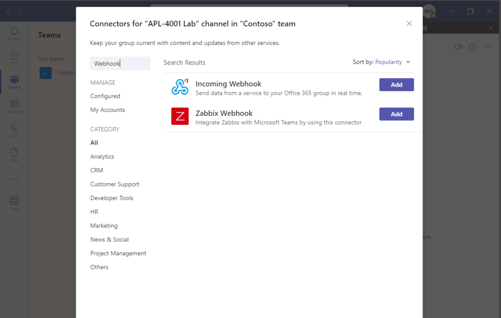

---
lab:
  title: 创建传入 Webhook
  module: Exercise 2
---

# 练习 2：创建传入 Webhook

## 场景

假设 IT 支持团队使用第三方通知服务来管理警报和消息。 最近，该团队决定自动将消息发布到用于关键更新的 Teams 频道。  第三方服务设计为通过 Webhook 发布消息。  

## 练习任务

你的任务是创建一个新的传入 Webhook（名为“警报”）来接收这些消息。****  你还应测试 Webhook，以确保它可以接受并正确显示包含字符串 `"Testing the Alerts endpoint."` 的消息。 当你完成任务后，该团队将使用 Webhook 终结点 URL 来更新服务。

你需要执行以下任务来完成练习：

1. 注册一个传入 Webhook。
2. 发布消息以测试该 Webhook。

**** 预计完成时间：8 分钟

## 任务 1：注册一个传入 Webhook

首先，注册一个传入 Webhook。

**注意：** 如果你用于此练习的 Teams 帐户中还没有团队包含频道，请在完成以下步骤之前创建一个新频道。

1. 在 Microsoft Teams 中，导航到可在其中配置 Webhook 的频道。
2. 在该频道中，选择“更多选项”菜单，然后选择“连接器”。********  （注意：请使用频道内的菜单，而不是频道列表中的菜单。）
3. 搜索 `"webhook"`，然后选择“传入 Webhook”。****

   

4. 选择 **添加** 。
5. 在概述页上，选择“添加”。****
6. 在该频道中，再次选择“更多选项”菜单，然后选择“连接器”。********
7. 在“传入 Webhook”旁边，选择“配置”。********
8. 对于名称，输入“警报”。****
9. 选择**创建**。  将此窗口保持打开状态，以便在下一个任务期间复制 URL。

你已在该频道中配置了传入 Webhook。

## 任务 2：发布消息以测试该 Webhook

若要测试 Webhook，请使用 PowerShell 将一条消息发送到 Webhook 终结点。

1. 打开 **PowerShell**。
2. 运行以下命令来发送消息。  将 <YOUR WEBHOOK URL> 替换为上一任务中 Teams 中 Webhook 配置窗口中的 URL：

     ```powershell
     Invoke-RestMethod -Method post -ContentType 'Application/Json' -Body '{"text":"Testing the Alerts endpoint."}' -Uri <YOUR WEBHOOK URL>
    ```

## 检查工作

1. 在 Microsoft Teams 客户端中，导航到所配置的频道的“对话”选项卡。****
2. 验证频道中是否存在来自 `Alerts` 且读作`"Testing the Alerts endpoint"` 的消息。

 
