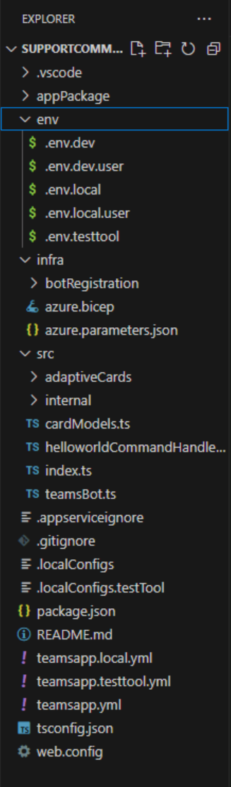
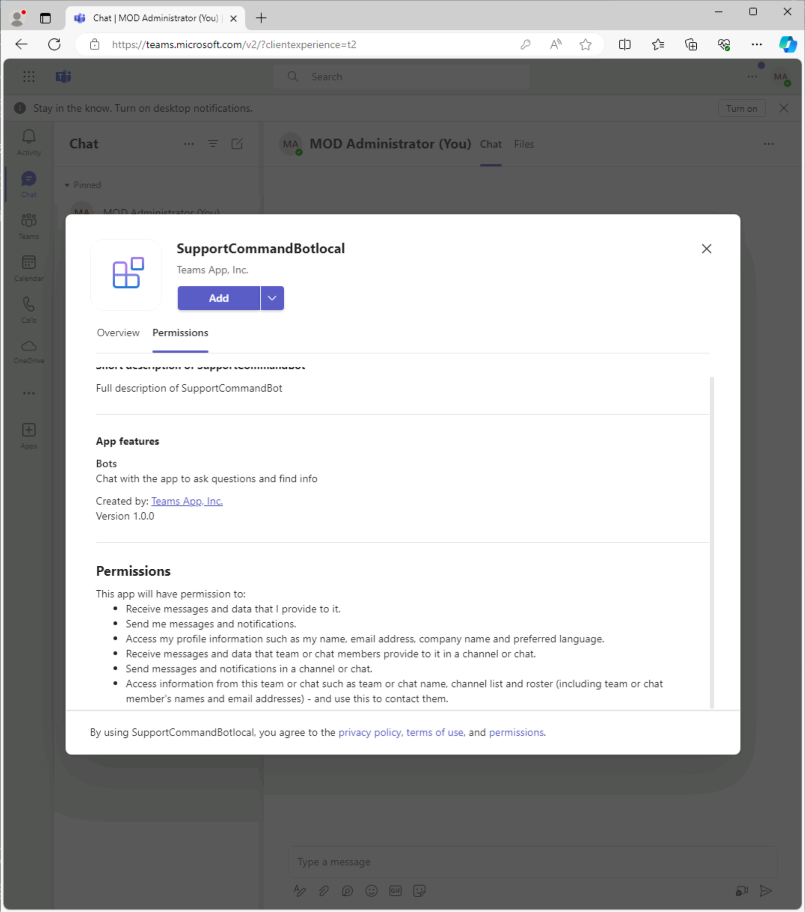
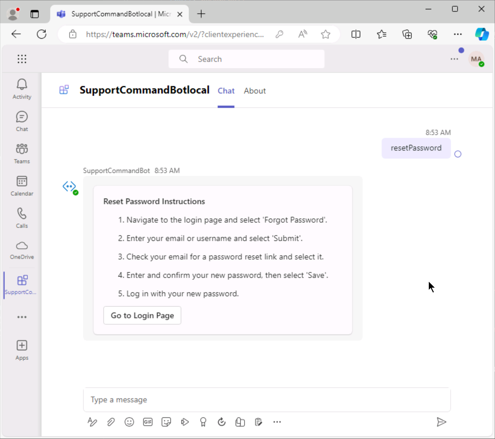

---
lab:
  title: 构建机器人
  module: Exercise 4
---

# 练习 4：构建机器人

## 场景

假设你所支持的 IT 支持团队从整个组织的员工那里收到大量常见的重复查询。 这些查询通常涉及简单的问题，例如密码重置、软件安装说明或常见错误的排除故障。

为了简化流程并减少你的团队的工作量，你决定创建一个可以在 Microsoft Teams 中处理这些常见查询的机器人。

你决定向机器人添加一个名为“resetPassword”的初始命令。 当用户键入此命令时，机器人将使用有关如何重置密码的分步说明进行答复。 这使得用户可以自己解决问题，而无需直接联系 IT 支持团队，从而将你的的团队解放出来以处理更复杂的问题。

除了“resetPassword”命令之外，你还计划添加更多命令来处理其他常见查询，使机器人成为供组织员工使用的综合性自助服务工具。

## 练习任务

你需要完成以下任务才能完成练习：

1. 使用 Teams Toolkit 创建机器人
2. 配置清单
3. 创建自适应卡片
4. 处理命令

**** 预计完成时间：17 分钟

## 任务 1：使用 Teams Toolkit 创建机器人

使用命令机器人模板创建一个新机器人：

1. 打开 Visual Studio Code。
1. 在边栏上，选择“**Microsoft Teams**”图标以打开“**TEAMS 工具包**”面板。
1. 选择“**创建新应用**”按钮。
1. 从“新建项目”菜单中，选择“机器人”，然后选择“聊天命令”以构建命令机器人。************
1. 对于“编程语言”，选择“TypeScript”。****
1. 对于“工作区文件夹”，选择或创建一个文件夹，用于在计算机上存储你的项目文件。****
1. 对于“应用程序名称”，输入“SupportCommandBot”，然后按 Enter。************ Teams 工具包将为新应用搭建基架，并在 Visual Studio Code 中打开项目文件夹。
1. 你可能会从 Visual Studio Code 收到一条消息，询问你是否信任此文件夹中的文件创建者。 选择“**是，我信任作者**”按钮以继续。
1. 使用 Visual Studio Code 中的资源管理器查看项目目录和文件，以熟悉源代码。 

## 任务 2：配置清单

在应用清单中定义 `ResetPassword` 命令：

1. 从 `appPackage` 文件夹中打开 `manifest.json` 文件。
2. 在 `bots` 对象中，找到 `commandLists`。  当前只有一个名为 `helloWorld` 的命令。
3. 将 `commands` 替换为以下代码，使其包括一个新的 `ResetPassword` 命令，如下所示：

    ```typescript
            "commands": [
                {
                    "title": "helloWorld",
                    "description": "A helloworld command to send a welcome message"
                },
                {
                    "title": "resetPassword",
                    "description": "Request instructions to reset your password"
                }
            ]
    ```

## 任务 3：创建自适应卡片

创建响应 `ResetPassword` 命令时要发送的自适应卡片：

1. 在 `src`/`adaptiveCards` 中，创建一个名为 `resetPassword.json` 的新文件。
2. 将以下内容添加到该文件并保存：

   ```json
        {
            "type": "AdaptiveCard",
            "body": [
                {
                    "type": "TextBlock",
                    "size": "Medium",
                    "weight": "Bolder",
                    "text": "Reset Password Instructions"
                },
                {
                    "type": "TextBlock",
                    "text": "1. Navigate to the login page and select 'Forgot Password'.",
                    "wrap": true
                },
                {
                    "type": "TextBlock",
                    "text": "2. Enter your email or username and select 'Submit'.",
                    "wrap": true
                },
                {
                    "type": "TextBlock",
                    "text": "3. Check your email for a password reset link and select it.",
                    "wrap": true
                },
                {
                    "type": "TextBlock",
                    "text": "4. Enter and confirm your new password, then select 'Save'.",
                    "wrap": true
                },
                {
                    "type": "TextBlock",
                    "text": "5. Log in with your new password.",
                    "wrap": true
                }
            ],
            "actions": [
                {
                    "type": "Action.OpenUrl",
                    "title": "Go to Login Page",
                    "url": "https://www.adaptivecards.io/designer/"
                }
            ],
            "$schema": "http://adaptivecards.io/schemas/adaptive-card.json",
            "version": "1.4"
        }
   ```

## 任务 4：处理命令

接下来，使用 `TeamsFxBotCommandHandler` 类处理机器人的源代码中的命令。  从 json 文件中导入 `resetPasswordCard`，并在该命令被调用时呈现它：

1. 在 `src` 文件夹中，创建一个名为 `resetPasswordCommandHandler.ts` 的新文件。
2. 将以下 import 语句添加到该文件，包括用于导入你创建的原始 `resetPassword` 卡片的语句：

   ```typescript
   import { Activity, CardFactory, MessageFactory, TurnContext } from "botbuilder";
    import { CommandMessage, TeamsFxBotCommandHandler, TriggerPatterns } from "@microsoft/teamsfx";
    import { AdaptiveCards } from "@microsoft/adaptivecards-tools";
    import rawResetPasswordCard from "./adaptiveCards/resetPassword.json";
   ```
3. 在这些 import 语句下方，添加以下代码来实现命令处理程序，然后保存该文件：

   ```typescript
       export class ResetPasswordCommandHandler implements TeamsFxBotCommandHandler {
          triggerPatterns: TriggerPatterns = "resetPassword";
        
          async handleCommandReceived(
            context: TurnContext,
            message: CommandMessage
          ): Promise<string | Partial<Activity> | void> {
            console.log(`App received message: ${message.text}`);
        
            const resetPasswordCard = AdaptiveCards.declareWithoutData(rawResetPasswordCard).render();
            await context.sendActivity({ attachments: [CardFactory.adaptiveCard(resetPasswordCard)] });
          }
        }
   ```

## 任务 5：注册新命令

需要在支持命令机器人模板的对话流的 `ConversationBot` 中配置每个新命令。

1. 导航到 `src/internal/initialize.ts` 文件。
2. 在第 2 行添加以下导入语句：

    `import { ResetPasswordCommandHandler } from "../resetPasswordCommandHandler";`
3. 在第 20 行，更新 `command` 属性的 `commands` 数组以包含用于初始化以下新处理程序的语句：`new ResetPasswordCommandHandler()`。  更新后的 `command` 对象应如下所示：

   ```json
   command: {    enabled: true,    commands: [new HelloWorldCommandHandler(), new ResetPasswordCommandHandler()],  },
    ```

## 任务 6：从开发隧道切换到 ngrok（可选）

如果开发环境不支持 Teams 工具包开发隧道，则可以将开发隧道替换为 ngrok。

1. 请按照以下步骤安装 ngrok：
   1. 转到 [ngrok 网站](https://ngrok.com/)并注册帐户。
   1. 下载操作系统的 ngrok 可执行文件。
   1. 将下载的文件提取到所选目录。
   1. 对于 Windows 环境，将 `ngrok.exe` 所在的目录添加到系统的 PATH 环境变量 
      ```powershell
      setx PATH "$Env:path;<ngrok_full_path>"
      ```
      _在 PowerShell 环境中，将 `<ngrok_full_path>` 替换为 `ngrok.exe` 所在路径。_
      > 若要应用此环境变量更改，需要为当前项目重启终端和 **Visual Studio Code**。

   1. 打开终端或命令提示符并运行以下命令，对 ngrok 帐户进行身份验证：
      ```shell
      ngrok config add-authtoken <your_auth_token>
      ```
      _将 `<your_auth_token>` 替换为 ngrok 网站上提供的身份验证令牌：_
   1. 若要在端口 3978 启动隧道，请运行以下命令：
      ```shell
      ngrok http 3978
      ```
   1. Ngrok 将生成一个转发 URL，可用于从 Internet 访问应用。
      ```shell
      Forwarding      http://<random_string>.ngrok-free.app -> http://localhost:3978
      ```
   1. 选择 `Ctrl + C` 断开 ngrok 隧道的连接。
1. 导航到`.vscode`文件夹，然后打开`task.json`文件。 更新 `Start local tunnel` 任务：
   ```json
    {
        "label": "Start local tunnel",
        "type": "shell",
        "command": "ngrok http 3978 --log=stdout --log-format=logfmt",
        "isBackground": true,
        "problemMatcher": {
            "pattern": [
                {
                    "regexp": "^.*$",
                    "file": 0,
                    "location": 1,
                    "message": 2
                }
            ],
            "background": {
                "activeOnStart": true,
                "beginsPattern": "starting web service",
                "endsPattern": "started tunnel|failed to reconnect session"
            }
        }
    }
   ```
1. 导航到根文件夹中的 `teamsapp.local.yml` 文件。 在预配生命周期的第一步中添加以下操作
   - Windows
     ```yml
     provision:
       - uses: script
         with:
           shell: powershell
           run: |
                for ($i = 1; $i -le 10; $i++) {
                    $endpoint = (Invoke-WebRequest -Uri "http://localhost:4040/api/tunnels" | Select-String -Pattern 'https://[a-zA-Z0-9 -\.]*\.ngrok-free\.app').Matches.Value
                    if ($endpoint) {
                        break
                    }
                    sleep 10
                }
                if (-not $endpoint) {
                    echo "ERROR: Failed to find tunnel endpoint after 10 attempts."
                    exit 1
                } else {
                    echo "::set-teamsfx-env BOT_ENDPOINT=$endpoint"
                    echo "::set-teamsfx-env BOT_DOMAIN=$($endpoint.Substring(8))"
                }
     ```
   - Linux 和 macOS
     ```yml
     provision:
        - uses: script
            with:
            run: |
                for i in {1..10}; do
                    endpoint=$(curl -s localhost:4040/api/tunnels | grep -o 'https://[a-zA-Z0-9 -\.]*\.ngrok-free\.app')
                    if [ -n "$endpoint" ]; then
                        break
                    fi
                    sleep 10
                done
                if [ -z "$endpoint" ]; then
                    echo "ERROR: Failed to find tunnel endpoint after 10 attempts."
                    exit 1
                else
                    echo "::set-teamsfx-env BOT_ENDPOINT=$endpoint"
                    echo "::set-teamsfx-env BOT_DOMAIN=${endpoint:8}"
                fi
     ```
     
## 检查你的工作

在本地运行你的应用以测试功能：

1. 打开 **TEAMS 工具包**平底板。 在“**开发**”菜单中，选择“**预览 Teams 应用**”（或使用 `F5` 键），然后选择使用你偏爱的浏览器“**在 Teams 中调试()**”。  
2. Teams Toolkit 将在浏览器中在本地预配和运行你的应用。
3. 在浏览器中的应用安装对话框中，选择“添加”以安装你的 Teams 应用。****  Teams 将打开与已安装机器人的对话。 
4. 输入或选择命令 `resetPassword`。
5. 验证机器人是否使用包含密码重置说明的自适应卡片进行答复。 
