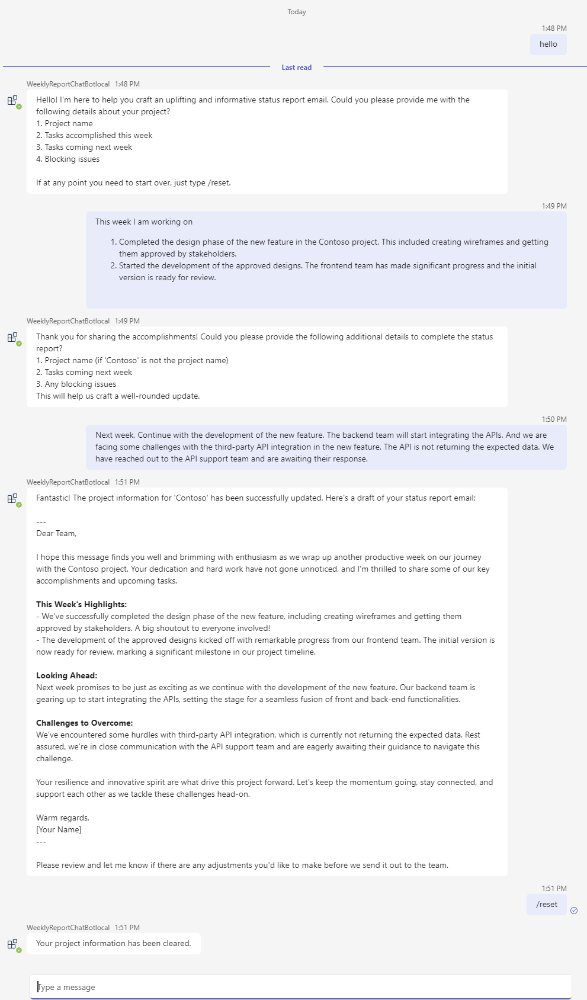

---
lab:
  title: 使用 AI 构建机器人
  module: Exercise 4
---

# 练习 4：使用 AI 构建机器人

## 场景

假设你是 IT 支持团队的成员。 你意识到编制周报是一个非常机械且耗时的过程。 你希望在 MS Teams 中创建 AI 机器人。 只需在对话中与机器人讨论每周工作项和下一周的任务，它就可以生成格式良好的周报。 这可以显著提高工作效率。

## 练习任务

你需要完成以下任务才能完成练习：

1. 使用 Teams AI 库创建机器人
1. 连接到 OpenAI 服务
1. 实现代码功能
1. 更新提示

**预计完成时间：** 20 分钟

## 先决条件

要在本地开发计算机上运行 AI 聊天机器人模板，不仅需要满足上一实验室中提到的资源要求，还需要一个 OpenAI 帐户。 此帐户可以是 [OpenAI](https://platform.openai.com/) 或 [Azure OpenAI](https://aka.ms/oai/access)。

## 任务 1：使用 Teams AI 库创建机器人

**目标：** 使用 Teams AI 库设置新的机器人项目，并熟悉项目结构和文件。  

使用 AI 聊天机器人模板创建一个新机器人：

1. 打开 Visual Studio Code。
1. 在边栏上，选择“**Microsoft Teams**”图标以打开“**TEAMS 工具包**”面板。
1. 选择“**创建新应用**”按钮。
1. 从“**新建项目**”菜单中，选择“**自定义 Copilot**”，然后选择“**基本 AI 聊天机器人**”以生成命令机器人。
1. 对于“编程语言”，选择“TypeScript”。****
1. 对于**大型语言模型 (LLM) 的服务**，请根据 LLM 帐户选择 **Azure OpenAI** 或 **OpenAI**。
1. 按 **Enter** 先跳过大型语言模型 (LLM) 设置。 将在下一步中设置 OpenAI 密钥。
1. 对于“工作区文件夹”，选择或创建一个文件夹，用于在计算机上存储你的项目文件。****
1. 对于**应用程序名称**，输入 **WeeklyReportChatBot**，然后按 **Enter**。 Teams 工具包将为新应用搭建基架，并在 Visual Studio Code 中打开项目文件夹。
1. 你可能会从 Visual Studio Code 收到一条消息，询问你是否信任此文件夹中的文件创建者。 选择“**是，我信任作者**”按钮以继续。
1. 使用 Visual Studio Code 中的资源管理器查看项目目录和文件，以熟悉源代码。

## 任务 2：连接到 OpenAI 服务

**目标：** 通过设置必要的 API 密钥和终结点，将机器人配置为直接通过 OpenAI 或使用 Azure OpenAI 连接到 OpenAI 服务。  

### 使用 OpenAI 帐户
1. 从 `env` 文件夹中打开 `.env.local.user` 文件。
1. 在文件 *env/.env.local.user* 中，填写 OpenAI 密钥 `SECRET_OPENAI_API_KEY=<your-key>`。
1. 从 `src` 文件夹中打开 `app.ts` 文件。
1. （可选）由于此演示使用了模型的规划功能，因此 gpt-4 比默认的 gpt-3.5 输出有了显著改进。 在文件 *src/config.ts* 中，从 `"gpt-3.5-turbo"` 到 `"gpt-4"` 或 `"gpt-4-turbo"` 更新 *openAIModelName* 属性值。

### 用户 Azure OpenAI
1. 从 `env` 文件夹中打开 `.env.local.user` 文件。
1. 在文件 *env/.env.local.user* 中，填写 Azure OpenAI 密钥 `SECRET_AZURE_OPENAI_API_KEY=<azure-openai-api-key>`、Azure OpenAI 终结点 `AZURE_OPENAI_ENDPOINT=<azure-openai-endpoint>` 和 Azure OpenAI 部署名称 `AZURE_OPENAI_DEPLOYMENT_NAME=<azure-openai-deployment-name>`。

## 任务 3：实现代码功能

**目标：** 通过修改 app.ts 文件、添加必要的导入和实现响应逻辑来处理用户交互，开发机器人的核心功能。  

1. 打开文件 *src/app/app.ts*。 我们将根据以下步骤修改此文件。 最终文件可以在 [app.ts](../../../Allfiles/Labs/Guided-Exercise5/app.ts) 中引用。
1. 从 `botbuilder` 添加 `TurnContext` 导入 
    ```typescript
    import { MemoryStorage, TurnContext } from "botbuilder";
    ```
1. 从 `@microsoft/teams-ai` 添加 `DefaultConversationState` 和 `TurnState` 导入
    ```typescript
    // See https://aka.ms/teams-ai-library to learn more about the Teams AI library.
    import { Application, ActionPlanner, OpenAIModel, PromptManager, DefaultConversationState, TurnState } from "@microsoft/teams-ai";
    ```
1. 在“*创建 AI 组件*”部分之前的文件 *src/app.ts* 中，添加 `ProjectInformation` 接口和 `ApplicationTurnState` 定义。
    ```typescript
    // Register project information item related handlers
    interface ProjectInformation {
      projectName: string;
      tasksAccomplished: string;
      tasksComing: string;
      blockingIssues: string;
    }

    // Strongly type the applications turn state
    interface ConversationState extends DefaultConversationState {
      greeted: boolean;
      projectInformation: ProjectInformation;
    }
    type ApplicationTurnState = TurnState<ConversationState>;

    // Create AI components
    ```
1. 在“*定义存储和应用程序*”部分后面的文件 *src/app.ts* 中，添加机器人对消息的响应。
    ```typescript
    // List for /reset command and then delete the conversation state
    app.message('/reset', async (context: TurnContext, state: ApplicationTurnState) => {
      state.deleteConversationState();
      await context.sendActivity("Your project information has been cleared.");
    });

    // Define the method for updating project information
    app.ai.action("updateProjectInformation", async (context: TurnContext, state: ApplicationTurnState, parameters: ProjectInformation) => {
      const conversation = ensureStateInitialized(state);
      if (parameters){
        if (parameters.projectName) {
          conversation.projectInformation.projectName = parameters.projectName;
        }
        if (parameters.tasksAccomplished) {
          conversation.projectInformation.tasksAccomplished = parameters.tasksAccomplished;
        } 
        if (parameters.tasksComing) {
          conversation.projectInformation.tasksComing = parameters.tasksComing;
        }
        if (parameters.blockingIssues) {
          conversation.projectInformation.blockingIssues = parameters.blockingIssues;
        }
        return `Project information was updated. Think about your next action`;
      }
    });

    // This method is used to make sure that the conversation state is initialized.
    function ensureStateInitialized(state: ApplicationTurnState): ConversationState {
      if (state.conversation.projectInformation == undefined) {
        state.conversation.projectInformation = {
          projectName: "",
          tasksAccomplished: "",
          tasksComing: "",
          blockingIssues: "",
        };
      }
      return state.conversation;
    }
    ```

## 任务 4：提示更新

**目标：** 优化机器人的对话提示并配置函数调用，以提高交互质量和生成周报的效率。

1. 更新 *src/prompts/chat* 文件夹中的 `skprompt.txt` 文件。  最终文件可以在 [skprompt.txt](../../../Allfiles/Labs/Guided-Exercise5/skprompt.txt) 中引用
    ```txt
    You are a Teams Bot. Here is how you will act.
    Team Bot will adopt an encouraging and positive tone in all its interactions. This will be reflected in the creation of status report emails, ensuring that they are not only informative but also boost morale and foster a joyous team spirit. The language used will be engaging and supportive, aiming to excite and inspire the team while maintaining a professional undercurrent appropriate for the communication between a project manager and their team and stakeholders in a professional corporate setting. The Teams Bot will always ask for information from the user when it is not provided. 
    # Teams Bot will ask for the following project information to make status report emails:
    1. project name
    2. tasks accomplished this week
    3. tasks coming next week
    4. blocking issues

    # Status report task description like SCRUM style summary

    # Then, the users will type in the parameters and the bot will make the email.

    # For the first time, users are informed that they can clear the entered ProjectInformation with /reset command.

    # THE SUMMARY MUST BE:
    - G RATED
    - WORKPLACE / FAMILY SAFE
    NO SEXISM, RACISM OR OTHER BIAS/BIGOTRY.

    project information:
    {{$conversation.projectInfomation}}

    Typescript Interfaces:
    interface ProjectInformation {
        projectName: string;
        tasksAccomplished: string;
        tasksComing: string;
        blockingIssues: string;
    }
    ```
1. 更新文件 `src/prompts/chat/config.json` 中的 `max_tokens` 和 `temperature` 参数。 此外，添加一个扩充节点参数。 最终结果如下。  可以在 [config.json](../../../Allfiles/Labs/Guided-Exercise5/config.json) 中引用
    ```json
    {
      "schema": 1,
      "description": "AI Bot",
      "type": "completion",
      "completion": {
        "max_tokens": 2500,
        "temperature": 0.1,
        "top_p": 0.0,
        "presence_penalty": 0.6,
        "frequency_penalty": 0.0
      },
      "augmentation": {
        "augmentation_type": "monologue"
      }
    }
    ```
1. 在 *src/prompts/chat* 文件夹中创建一个名为 `actions.json` 的新文件。 文件的内容如下所示。 此文件阐明 AI 要使用的方法。 可以在 [actions.json](../../../Allfiles/Labs/Guided-Exercise5/actions.json) 中引用
    ```json
    [
        {
            "name": "updateProjectInformation",
            "description": "updates the information for the existing project",
            "parameters": {
                "type": "object",
                "properties": {
                    "projectName": {
                        "type": "string",
                        "description": "The name of the project"
                    },
                    "tasksAccomplished": {
                        "type": "string",
                        "description": "tasks that have been accomplished"
                    },
                    "tasksComing": {
                        "type": "string",
                        "description": "tasks that are coming up"
                    },
                    "blockingIssues": {
                        "type": "string",
                        "description": "any blocking issues"
                    }
                }
            }
        }
    ]
    ```

## 检查你的工作

在本地运行你的应用以测试功能：

1. 打开 **TEAMS 工具包**平底板。 在“**开发**”菜单中，选择“**预览 Teams 应用**”（或使用 `F5` 键），然后选择使用你偏爱的浏览器“**在 Teams 中调试()**”。  
2. Teams Toolkit 将在浏览器中在本地预配和运行你的应用。
3. 在浏览器中的应用安装对话框中，选择“添加”以安装你的 Teams 应用。****  Teams 将打开与已安装机器人的对话。
4. 输入问候信息后，按照提示输入项目名称、已完成任务、未完成任务和阻塞任务。 然后，AI 机器人将生成类似于以下屏幕截图的每周报告。
5. 验证机器人是否按如下所示回复了正确的答案。 
